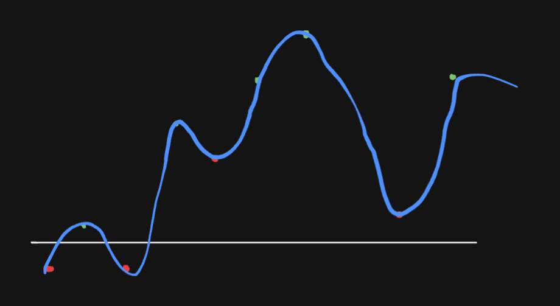

## Table of contents

## The maximum subarray problem
I've recently decided to improve my coding skills by practicing regularly on [Codewars](https://www.codewars.com/), a coding challenge website similar to LeetCode. After some quite trivial problems, I stumbled upon an interesting one: the [*maximum subarray problem*](https://www.codewars.com/kata/54521e9ec8e60bc4de000d6c). Here's its statement:

> The maximum sum subarray problem consists in finding the maximum sum of a contiguous subsequence in an array or list of integers...

Let's say you have an array of numbers just like this:
```javascript
[-2, 1, -3, 4, -1, 2, 1, -5, 4]
```
The maximum sum of a contiguous subsequence would be **6**, because of the subarray composed of these values:
```javascript
[4, -1, 2, 1] // indexes from 3 to 6 of the original array
```

Alright, the problem statement was clear enough. But what about the solution? I've been looking to the sample arrays provided by the challenge for hours, and I really just couldn't seem to find a smart, elegant way to find the maximum subarray -- and I knew there was one, for sure.

To me, **thinking about subarrays is like thinking about windows**. A generalized solution must be able to find any slice, any range of indexes that when added together has the highest value compared to any other range.

## The worst solution possible: comparing all the windows

After some hours thinking about windows I decided to put aside perfectionism and the expectation of finding a smart solution. [I was blocked](https://en.wikipedia.org/wiki/Einstellung_effect), and I just had to try if at least the worst solution I could imagine might have worked or not.

So here it is, [my first solution](https://www.codewars.com/kata/reviews/54661647829127dabe0000ff/groups/65c403cc9b585b0001c7d4da): a really inefficient algorithm that checks *all* of the possible windows -- every position and size -- and keeps record of the maximum sum.

The first loop goes *from the largest to the shortest* span, or window "size"; the second loop "moves" the window "from left to right" and computes the relevant sums in each moment.

```javascript
const sum = (arr) => arr.reduce((total, current) => total + current, 0)

const maxSequence = function(arr){
  let start = 0;
  let end = arr.length - 1
  
  if (arr.length === 0 || arr.every((el) => el < 0)) return 0;
  
  // From largest to shortest span, or "window size"
  for (let span = end; span >= 0; span--) {
  // Moving the current "window" from "left to right"
    for (let offset = 0; offset < arr.length - span; offset++) {
      const compareSequence = sum(arr.slice(start, end + 1));
      const currentSequence = sum(arr.slice(offset, offset + span + 1));
      if (currentSequence > compareSequence) {
        start = offset;
        end = offset + span;
      }
    }
  }
  
  return sum(arr.slice(start, end + 1));
}
```
This solution happened to work. I was relieved, but not satisfied: I knew I had deliberately given my worst, and I was sure that if I ever decided to check the other *practitioners'* solutions I would have been hit by heavy disappointment seeing one-liner solutions or something.

And this is exactly what happened, because on the next day I still couldn't think of a better solution and I decided to have *just one look* to the first other practitioners' solutions.

## Measuring mountains: Kadane's algorithm

There, I discovered two things: the challenge is a [classic coding problem](https://en.wikipedia.org/wiki/Maximum_subarray_problem) solved best by "Kadane's algorithm", and its implementation wasn't more than 10 lines of JavaScript.

I still wanted to develop an *own* solution, so I just gave a quick glance so that the solution could serve me more as a hint. The only thing that stick to my mind was that there was only one loop, and a weird combination of `Math.max()` calls accomplishing something I couldn't grasp.

After one more day I came up with something so simple that at first I couldn't really believe that it would work:

```javascript
const maxSequence = function(arr){
  let currentSum = 0;
  let maxSum = 0;
  for (const num of arr) {
    currentSum = Math.max(0, currentSum + num);
    if (currentSum > maxSum) maxSum = currentSum;
  }
  
  return maxSum;
}
```
The solution worked, and the reason is that the most useful way to imagine this problem -- to understand Kadane's algorithm -- is thinking about mountains rather than windows.

**The key idea is that, when sequentially adding numbers to build the maximum sum possible, all the previous contributions that cause it to _sink_ below-zero don't matter.**




This drawing masterpiece tries to emulate the overall sum of the array in this post's opening:

```javascript
[-2, 1, -3, 4, -1, 2, 1, -5, 4]
```
Red dots represent negative contributions, while greens are the positive ones. Only the positive sequences are meaningful to us, and they may look just like mountains.

- The most useful way to use this metaphor is to imagine walking on the curve from left to right, only starting to count when the level is *above sea* and keeping track of the highest peak that has been reached until the current iteration.
- Every time we are able to push the peak record higher, we know another useful positive integer has just entered our sequence.
- If we go back below zero, we know we clearly are not inside a positive and meaningful sequence, so we can reset our counter to zero.
- The highest peak marks the end of the maximum subarray, since the numbers after it cannot contribute enough to the goal.

I've also made an [animated visualization](https://stackblitz.com/~/github.com/riccardobattiato/maximum-subarray-problem) hoping that it could help someone to understand the solution.